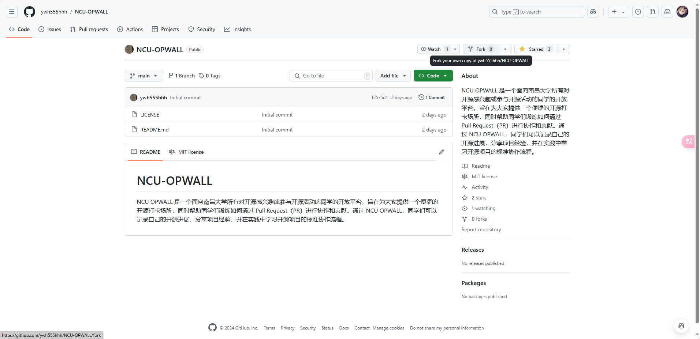

# 关于在GitHub上如何提交PR

## PR（Pull Request）是什么？它有什么用？

试想，你想参与进一个开源项目，修改里面的一个文件，你该怎么做？

很显然，倘若这个项目允许任何人随意修改的话，那么随便来个不负责任的乐子人随意修改代码

或者是直接删掉全部代码，那这个开源项目大概也是没救了

但如果不允许其它人来修改代码，又不太现实

一来各种bug要靠项目管理者一个人亲力亲为修改

二来这有害于开源项目的扩大与发展

三来这也与我们常说的开源精神相悖

所以就有了PR（Pull Request）来帮助我们解决这个问题

（PR直译为拉取请求，有点拗口，所以一般直接简称为pr就够了）

简言之，就是你先提交修改请求，然后由项目维护者审核，审核通过，并入项目仓库，就这么简单

## PR的大致流程

PR的逻辑整体就是，你先复刻（Fork）一份你要修改的目标仓库，复刻到你个人的仓库里

然后在本地克隆（Clone）一份目标仓库，或者克隆一份你复刻的仓库也行

创建一个新的分支（Branch）（跟新建文件夹一样），命名上最好清晰明了

然后就可以进行你的修改了，随便怎么改

乐意的话写篇*恩情文.txt*也行

修改完成，先缓存（Add)到本地，再提交(Commit)到本地仓库，这样就完成了本地仓库的修改

接下来将你所做的修改，推送（Push）到你的GitHub个人仓库里

最后，为了将你的修改提交到你的目标仓库

创建一份PR，选择你刚修改的分支，并填写必要信息，向目标仓库提交合并请求就好了

审核通过以后，你就能在仓库里面看到你的代码了

这样，你就完成了你对开源项目的第一份贡献

## PR的具体操作方式

#### 以下内容默认你的网络配置正常

### 关于git的下载

这里我们需要引入一个关键工具——**Git**

“Git 是一个免费且开源的分布式版本控制系统，旨在处理从小型到非常大型项目，具有高速和高效性。”（官网介绍）

总的来说，我们需要Git来帮助实现我们PR的步骤

以下提供windows电脑的Git下载方法

打开[Git 官方网站](https://git-scm.com/)，


选择Downloads，选择Windows，然后根据你电脑的情况选择你需要的Git版本（通常会是64位）

最好下载Standalone Installer版，更适合在系统中进行完整安装和集成，可以创建快捷方式，并能够通过控制面板进行卸载。

双击下下来的exe安装程序，大部分直接按默认配置选next就性，担心存储空间不足的话可以修改一下安装路径

安装完成后，可以通过以下代码在终端确认是否安装完成——

（一般推荐在文本编辑器终端输入命令代码，或者win+R，输入cmd打开系统命令行界面也是可以的）
```sh
git --version
```
安装完成的话，应该会有这样的输出——
```sh
git version 2.46.0.windows.1
```
最后我们只需配置好Git用户信息即可
```sh
git config --global user.name "你的用户名"
git config --global user.email "你的邮箱地址"
```
然后，我们就可以开始使用Git来帮助我们实现PR了

### 复刻

打开你的目标仓库



点击Fork，然后再点击右下角绿色的Creat Fork

等待几秒，就会自动跳转到你复刻下来的仓库

复制下浏览器顶上仓库的网址（以下为示例网址）


### 克隆

先进入你想存储本地仓库的位置
```sh
cd 指定目录 #可以先用文件管理器打开你想存储的位置，然后把文件路径复制下来
```
关于目录命令还有以下——
```sh
cd .. #返回上一级
cd / #返回根目录
ls #列出当前目录下所有文件
mkdir fodler #新建名为“folder”的文件夹
```
在终端输入以下代码
```sh
git clone https://...... #此处是你复制下来的网站地址
```
然后，你就能在你所在的文件目录下看到你克隆下来的仓库了

进入仓库目录即可
```sh
cd your-cloned-repo  # 进入克隆的仓库目录
```

### 修改

创建新的分支，以提供你对仓库操作的地方，同时进入改分支
```sh
git checkout -b new-branch-name  # 创建并切换到新分支
```
可通过以下代码查看当前分支位置
```sh
git branch
```
一般输出会是你刚刚新建的分支

在目录里右键新建文件并打开，或者直接打开已有文件，即可开始你的修改

### 提交
保存你的修改，同时提交到本地仓库
```sh
git add .  # 添加所有更改到暂存区
git commit -m "描述您的更改"  # 提交更改并添加提交信息
```
推送到远程仓库里的分支
```sh
git push --set-upstream origin new-branch-name  
#git push为推送操作
#--set-upstream可以使本地分支与远程分支关联，这样以后可以直接使用git push进行推送，无需指定远程分支
#origin处填的应该是远程仓库的名称，但origin会直接指向你克隆的仓库
#new-branch-name为推送到远程仓库的新分支的名称。在关联后无需这一步。
```

### 创建PR
在浏览器里打开你的GitHub仓库页面，切换到你刚推送的新分支

然后，你会看到仓库右上角

